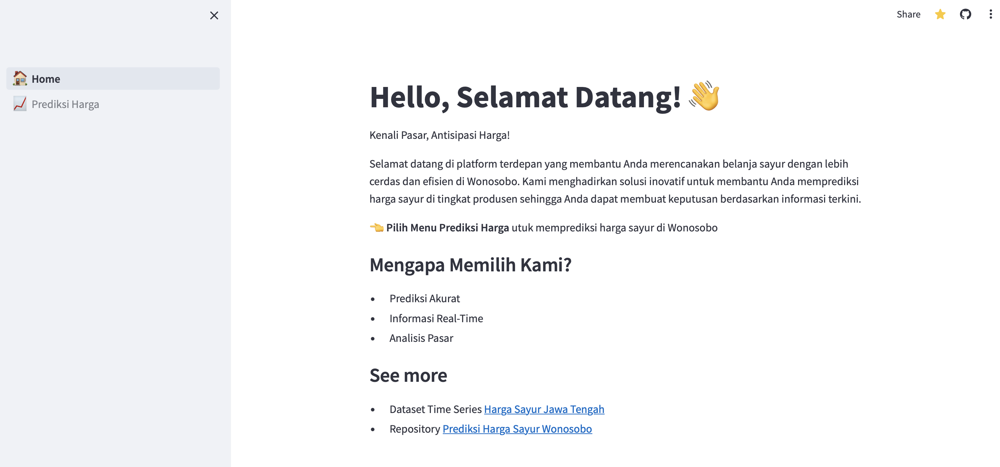
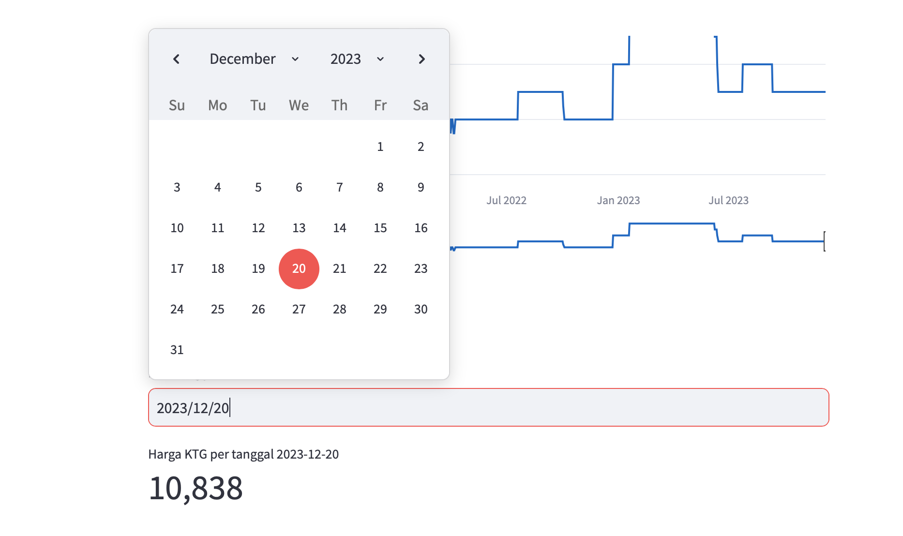

## Panduan Install Aplikasi

- Sebelum membuat proyek Laravel pertama Anda, pastikan bahwa mesin lokal Anda telah menginstal Python v9.1 keatas dan PIP.
- Setelah Anda menginstal Python dan PIP, Anda dapat clone repositori project aplikasi atau download repositori project pada github sebagi [berikut](https://github.com/ahmdriffai/wsb-vegetablesprice-forecast.git).
- Setelah clone atau download repositori, selanjutnya masuk kedalam project, kemudian buka terminal yang mengarahkan ke direktori project kemudian install `requirement.txt` dengan perintah sebagai berikut:
    ```
    pip install -r requirements.txt
    ```

- setelah install requirement kemudian ketik perintah berikut pada terminal
  ```
    streamlit run streamlit_app.py
    ```
- dan akan menghasilkan alamat server local dengen alamat 
  ```
    Local URL: http://localhost:8501
    Network URL: http://<localip>:8501
  ```
- buka alamat server dan aplikas siap digunakan
- selesai

## Panduan Penggunaan Aplikasi
- Buka servel local yang sudah terinstall atau bisa menggunakan aplikasi yang sudah di deploy dengan alamat url : https://prediksisayurwsb.streamlit.app
- Kemudian akan langsung diarahkan ke home page, seperti pada gambar berikut.
  
- Setelah itu, pilih menu Prediksi Harga pada menu bar, dan akan diarahkan ke prediksi harga sayur di wonosobo, disana terdapat beberapa informasi seperti grafik harga kentang sebelumnya dan prediksi harga kentang  1 tahun kedepan.
- Untuk memprediksi harga kentang pilih form` Pilih tanggal prediksi` , kemudian akan menghasilkan hasil prediksi pad tanggal yang dipilih, seperti pada gambar berikut: 
  
